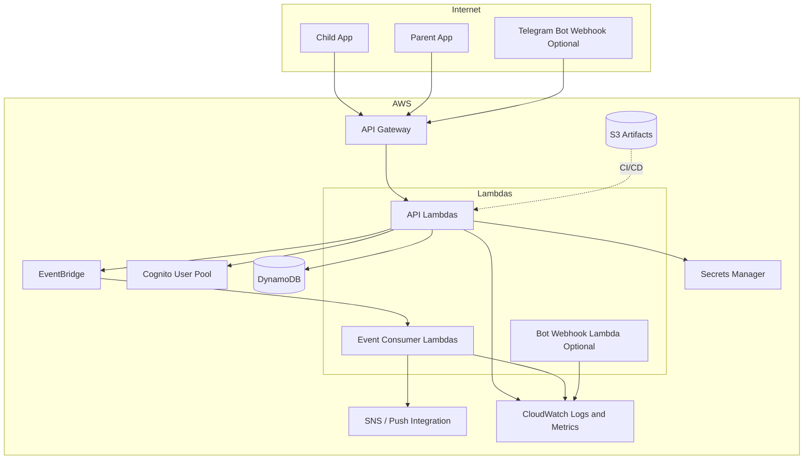

# AWS Infrastructure Architecture

## Purpose

This document defines the MVP AWS infrastructure architecture.

## Infrastructure Diagram

## AWS Services

| Service | MVP Use |
| --- | --- |
| API Gateway | Public HTTPS API for mobile apps and optional bot webhook |
| Lambda | API handlers, domain event consumers, notification jobs |
| DynamoDB | Families, children, approval requests, decisions, audit, notification tokens |
| Cognito | Parent authentication and token issuance |
| EventBridge | Domain event bus |
| SNS / push provider integration | Parent and child notifications |
| Secrets Manager | Telegram bot token, signing secrets, external provider secrets |
| S3 | Build artifacts, future exports, static assets if needed |
| CloudWatch | Logs, metrics, alarms |
| IAM | Least-privilege service permissions |
| Terraform | Infrastructure as code |
| GitHub Actions | CI/CD |

## Environment Strategy

Recommended environments:

- `dev`: developer integration and unstable testing.
- `staging`: production-like validation.
- `prod`: live families and children.

Each environment should have isolated AWS resources, DynamoDB tables, Cognito user pools, secrets, and event buses.

## Deployment Flow

## Backend Runtime Boundaries

API Lambdas:

- Authenticate request.
- Validate command.
- Load aggregate state.
- Apply domain rule.
- Persist state.
- Publish domain event.
- Return response.

Event consumer Lambdas:

- Process domain events.
- Send notifications.
- Write audit projections when needed.
- Retry idempotently.

## DynamoDB MVP Tables

The exact table design must follow documented access patterns. A conservative MVP design may use:

- `CoreTable`: families, parents, children, Telegram account metadata, join requests, decisions.
- `AuditTable`: append-only audit events.
- `NotificationTable`: device tokens, notification preferences, delivery attempts.

Single-table design is allowed only if partition and sort key access patterns are documented before implementation.

## Security Controls

- Least-privilege IAM per Lambda.
- Secrets stored only in Secrets Manager.
- No Telegram child session material in backend.
- Encryption at rest for DynamoDB, S3, CloudWatch logs, and Secrets Manager.
- HTTPS-only API access.
- Structured logs with sensitive-field redaction.
- Separate production secrets and resources.

## Observability

Required MVP metrics:

- API latency and error rate.
- Join requests created.
- Approval decisions by status.
- Pending approval age.
- Join execution latency.
- Join execution failures by reason.
- Notification delivery failures.
- Lambda retries and dead-letter counts.

Required logs:

- Request correlation ID.
- Parent ID or child ID where safe.
- Request ID.
- Decision source.
- Event type.
- Telegram error category, without sensitive payloads.

## Cost and Scaling Notes

Serverless services keep baseline MVP cost low. DynamoDB capacity should start with on-demand billing unless predictable usage justifies provisioned capacity later.

CloudWatch log retention should be explicitly configured per environment to avoid uncontrolled retention cost.

## Related ADRs

- [ADR-004: DynamoDB Over PostgreSQL for MVP Backend](../decisions/ADR-004-dynamodb-over-postgresql-for-mvp-backend.md)
- [ADR-005: AWS Serverless Over ECS for MVP](../decisions/ADR-005-aws-serverless-over-ecs-for-mvp.md)
- [ADR-008: Use Cognito for Parent Identity](../decisions/ADR-008-use-cognito-for-parent-identity.md)
- [ADR-009: Use EventBridge for Approval Workflow Events](../decisions/ADR-009-use-eventbridge-for-approval-workflow-events.md)
