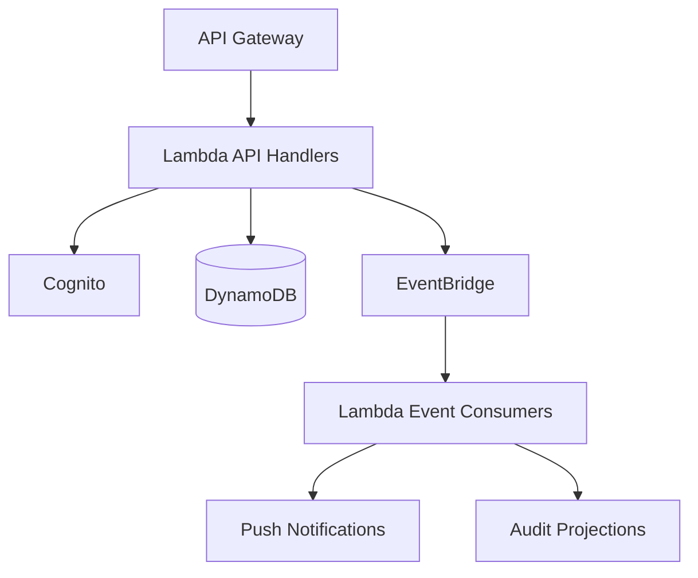

# Backend Architecture

## Architectural Style

Serverless

## Technology Stack

- TypeScript
- Node.js
- AWS Lambda
- API Gateway
- DynamoDB
- EventBridge
- SNS
- Cognito
- S3
- Secrets Manager

## Design Principles

- Clean Architecture
- Domain-driven design concepts where appropriate
- Event-driven integrations
- Backend ownership of business rules
- Idempotent commands and event consumers
- Minimal storage of Telegram metadata
- No backend custody of child Telegram session material

## Runtime Shape

## Application Modules

- Family
- Parent
- Child
- Telegram account metadata
- Join requests
- Approval decisions
- Approval execution reports
- Notifications
- Audit
- Optional Telegram Bot webhook

## Command Flow

1. API Gateway receives a mobile or bot request.
2. Lambda validates identity and command input.
3. Backend loads source-of-truth state from DynamoDB.
4. Domain rules authorize and apply the state transition.
5. Backend persists the state change and audit facts.
6. Backend publishes domain events to EventBridge.
7. Event consumers send notifications and update projections.

## Events

Examples:

- JoinRequestCreated
- JoinRequestApproved
- JoinRequestRejected
- JoinExecutionSucceeded
- JoinExecutionFailed
- TelegramAdminApprovalPending

## Consumers

- Push Notifications
- Telegram Bot
- Audit Logging
- Analytics

## Related Documents

- [MVP Architecture](mvp-architecture.md)
- [AWS Infrastructure Architecture](aws-infrastructure-architecture.md)
- [Telegram Integration Architecture](telegram-integration-architecture.md)
