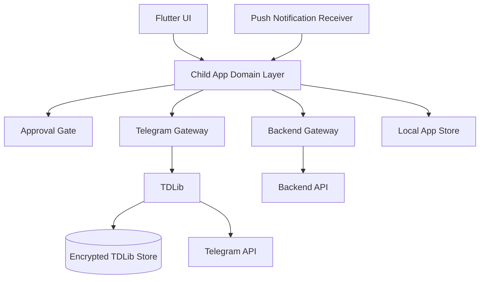
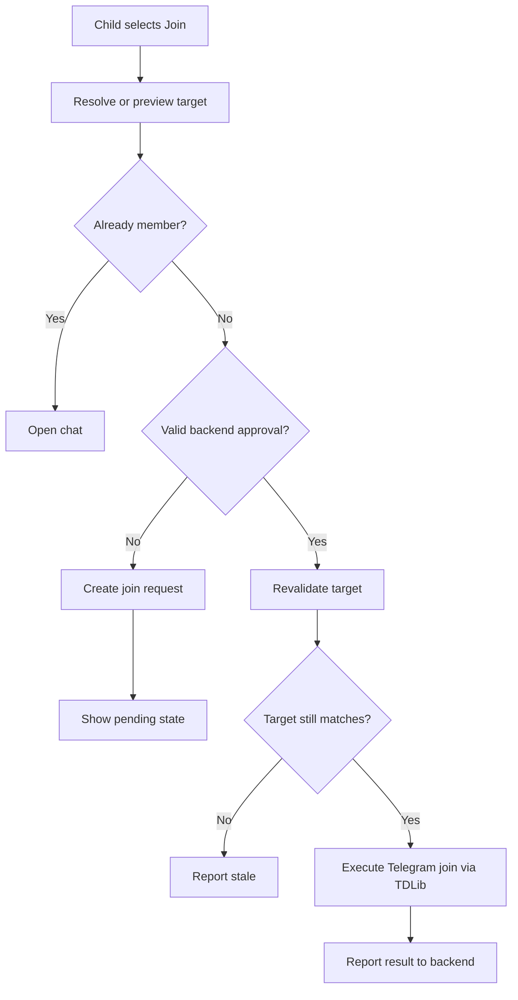

# Child App Architecture

## Purpose

The child app provides a familiar Telegram experience while gating group joins and channel subscriptions behind backend approval.

## Platform

- Flutter.
- Android target for MVP.
- Native Android platform integration where required for TDLib and device APIs.
- TDLib for Telegram client functionality.
- Backend API over HTTPS.
- Push notifications for approval updates and synchronization hints.

## Component Diagram

## Responsibilities

- Authenticate child with Telegram through TDLib.
- Maintain local Telegram client state required by TDLib.
- Render Telegram chats and messages.
- Send and receive direct messages.
- Read channels already available to the child.
- Intercept all join-capable UI and deep-link paths.
- Create join requests through backend API.
- Execute approved joins only after backend validation.
- Report join execution status.

## Restricted Actions

The child app must gate:

- Public channel join.
- Public supergroup join.
- Private invite import.
- Channel subscription through invite.
- Group join through invite.
- Any future UI path that maps to Telegram join behavior.

The child app must not call `channels.joinChannel` or `messages.importChatInvite` unless it has a valid backend approval for the exact target.

## Join Gating Flow

## Local Data

Allowed local data:

- TDLib encrypted database.
- Local app preferences.
- Cached non-sensitive backend state.
- Push token.
- Pending execution queue.

Disallowed local-to-backend transmission:

- Telegram login codes.
- Telegram 2FA password.
- Telegram auth key.
- TDLib database encryption key.
- Raw TDLib session material.

## Synchronization

The child app should synchronize on:

- App start.
- Login completion.
- Push notification received.
- Return to foreground.
- Pending request screen open.
- Join execution completion.

Push notifications are hints. Backend API state is authoritative.

## Failure Handling

- Offline during request creation: queue draft locally or show retry.
- Offline after parent approval: execute when app next syncs.
- Telegram invite expired: report `EXPIRED` or `FAILED`.
- Telegram target changed: report `STALE`.
- Telegram admin approval required: report `ADMIN_APPROVAL_PENDING`.
- Already joined: report idempotent success or policy conflict depending on request context.

## Security Notes

- Child app cannot be trusted to approve its own requests.
- Backend must validate every request and approval token.
- Jailbroken/rooted device detection may be considered later, but is not MVP enforcement.
- Official Telegram bypass must be addressed by parent device controls outside the child app.
