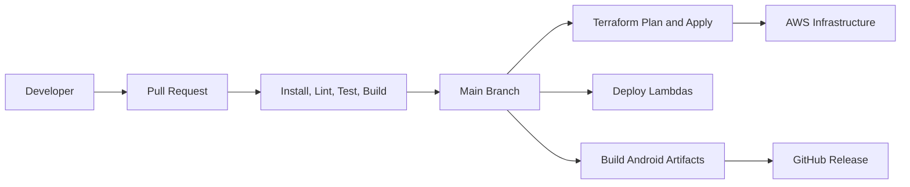

# Deployment Architecture

## Infrastructure

AWS

## Infrastructure as Code

Terraform

## Services

API Layer:

- API Gateway

Compute:

- Lambda

Storage:

- DynamoDB
- S3

Identity:

- Cognito

Messaging:

- SNS
- EventBridge

Secrets:

- Secrets Manager

Monitoring:

- CloudWatch

## Environment Strategy

- dev
- staging
- prod

Each environment must isolate Cognito user pools, DynamoDB tables, EventBridge buses, secrets, and notification configuration.

## CI/CD

GitHub Actions

### Pull Request Pipeline

- Install
- Lint
- Test
- Build

### Main Branch Pipeline

- Test
- Build
- Terraform Apply
- Deploy Lambdas

### Release Pipeline

Triggered by tags:

vX.Y.Z

Artifacts:

- Android APK
- Android AAB

Publish artifacts into GitHub Releases.

## Deployment Diagram

## Related Documents

- [AWS Infrastructure Architecture](aws-infrastructure-architecture.md)
- [MVP Architecture](mvp-architecture.md)
