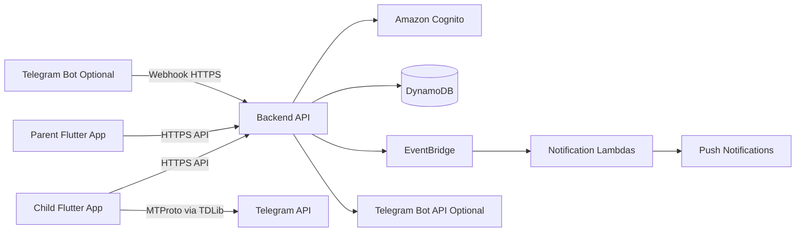
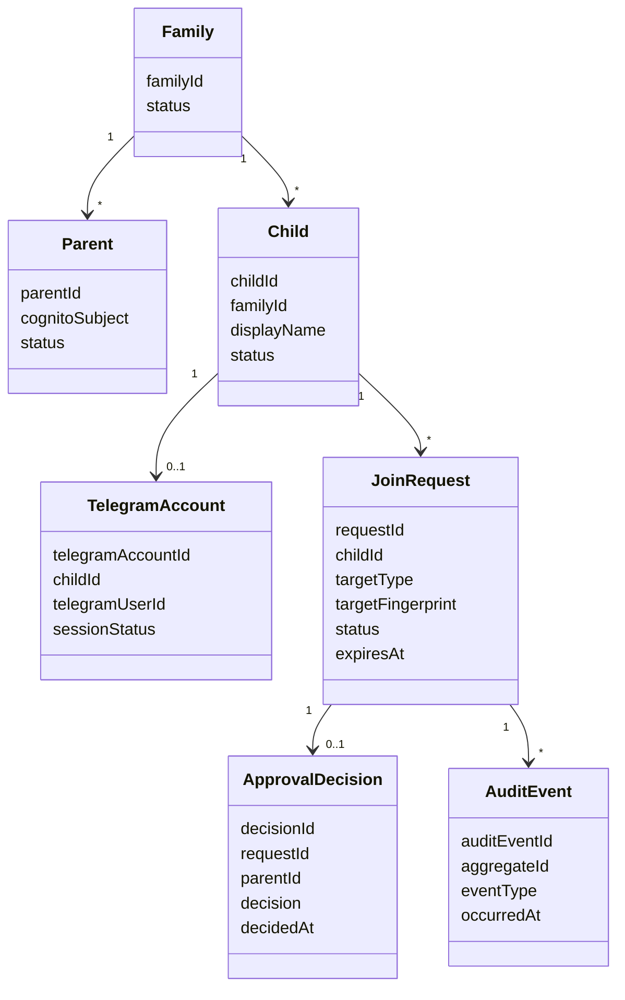
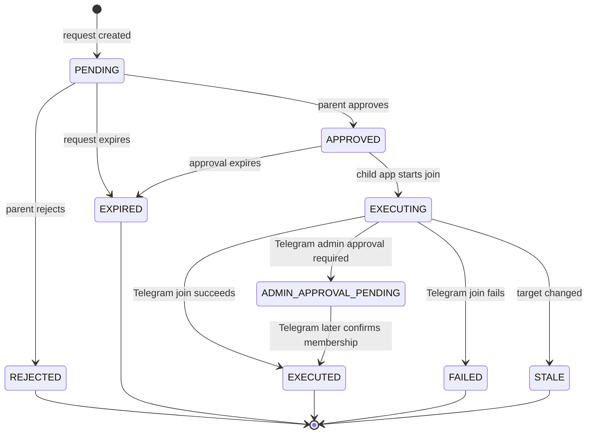
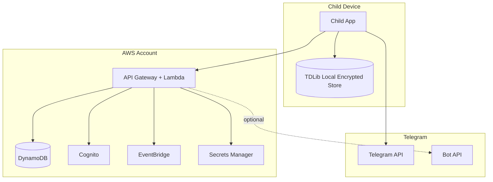

# MVP Architecture

## Purpose

This document defines the complete MVP architecture for Telegram Kids.

The MVP validates one product promise: children cannot join Telegram groups or subscribe to Telegram channels through Telegram Kids without parental approval.

## Architecture Principles

- Backend is the single source of truth for family, child, approval, decision, audit, and notification state.
- Child client is never trusted for authorization decisions.
- Telegram user session material stays on the child device for MVP.
- Parent app is the primary approval interface.
- AWS serverless is the default backend and infrastructure model.
- Telegram Bot is optional and secondary for MVP.
- All major workflow state transitions are auditable.

## System Context

## Runtime Components

### Child App

The child app is a Flutter application targeting Android for MVP. It will integrate with TDLib through native platform integration, authenticate the child with Telegram, render Telegram messages and chats, and intercept restricted join actions before TDLib join calls are made.

Responsibilities:

- Telegram user authentication through TDLib.
- Telegram chat list, direct messaging, receiving messages, sending messages, and channel reading.
- Local encrypted Telegram session storage.
- Deep-link handling for Telegram links.
- Join-target discovery and preview.
- Approval request creation through backend API.
- Approved join execution after backend validation.
- Execution-result reporting to backend.

Non-responsibilities:

- Parent approval decisions.
- Family account authority.
- Backend audit state.
- Global enforcement outside Telegram Kids.

### Parent App

The parent app is a Flutter application targeting Android for MVP parent authentication and approval workflows.

Responsibilities:

- Parent sign-in.
- Family and child context display for MVP.
- Pending approval list.
- Approval and rejection actions.
- Approval history.
- Device setup guidance for blocking official Telegram bypass paths.

Non-responsibilities:

- Direct Telegram user-client operations.
- Telegram session custody for the child.
- Backend source-of-truth state.

### Backend

The backend is a TypeScript/Node.js AWS serverless application.

Responsibilities:

- Parent authentication integration with Cognito.
- Parent, child, family, and Telegram account records.
- Join request state machine.
- Approval decision validation.
- Approval token issuance.
- Audit logging.
- Notification event publishing.
- Optional Telegram Bot webhook and outbound bot notifications.

Non-responsibilities:

- Storing child Telegram auth keys.
- Executing Telegram joins for MVP.
- Preventing official Telegram or third-party Telegram client usage.

### Telegram Integration

Telegram integration has two separate surfaces:

- Child user-client integration through TDLib and MTProto.
- Optional parent-facing Telegram Bot integration through Bot API.

The Bot API must not be used for child Telegram account operations because bots cannot act as the child user.

### AWS Infrastructure

MVP infrastructure uses:

- API Gateway for HTTP APIs.
- Lambda for API handlers and event consumers.
- Cognito for parent identity.
- DynamoDB for operational state.
- EventBridge for domain events.
- SNS or platform push integration for mobile notifications.
- Secrets Manager for application secrets.
- S3 for build artifacts or future static assets.
- CloudWatch for logs, metrics, and alarms.
- Terraform for infrastructure as code.
- GitHub Actions for CI/CD.

## Approval Workflow

```mermaid
sequenceDiagram
    participant C as Child App
    participant B as Backend API
    participant E as EventBridge
    participant P as Parent App
    participant T as Telegram API via TDLib

    C->>C: Child taps Join
    C->>C: Resolve/preview Telegram target
    C->>B: Create join request
    B->>B: Store request as PENDING
    B->>E: Publish JoinRequestCreated
    E->>P: Notify parent
    P->>B: Approve or reject
    B->>B: Store decision and audit event
    B->>E: Publish JoinRequestApproved or Rejected
    E->>C: Notify child app
    C->>B: Fetch executable approval
    B->>C: Return scoped approval token
    C->>T: Execute join only if approved
    T->>C: Return join result
    C->>B: Report execution result
    B->>B: Store EXECUTED, FAILED, STALE, or ADMIN_APPROVAL_PENDING
```

## Data Ownership

| Data | Owner | Storage |
| --- | --- | --- |
| Parent identity | Cognito and backend | Cognito, DynamoDB profile |
| Child profile | Backend | DynamoDB |
| Family membership | Backend | DynamoDB |
| Telegram account binding | Backend | DynamoDB metadata only |
| Telegram auth key/session | Child app | TDLib local encrypted storage |
| Join request | Backend | DynamoDB |
| Approval decision | Backend | DynamoDB |
| Approval execution result | Backend | DynamoDB |
| Audit event | Backend | DynamoDB, future analytics projection |
| Push notification token | Backend | DynamoDB or notification provider |

## Core Domain Model

## Join Request State Machine

## API Surface

MVP API groups:

- `Auth`: parent identity context and session validation.
- `Families`: parent family and child access.
- `Children`: child profile and device registration.
- `TelegramAccounts`: child Telegram account binding metadata.
- `JoinRequests`: create, read, approve, reject, execute, and report result.
- `Notifications`: device token registration and notification preferences.
- `BotWebhook`: optional Telegram Bot inbound updates.

All mutating APIs must be idempotent where retry is possible.

## Event Model

MVP domain events:

- `JoinRequestCreated`
- `JoinRequestApproved`
- `JoinRequestRejected`
- `JoinRequestExpired`
- `JoinExecutionStarted`
- `JoinExecutionSucceeded`
- `JoinExecutionFailed`
- `JoinExecutionStale`
- `TelegramAdminApprovalPending`
- `TelegramAccountLinked`
- `TelegramAccountUnlinked`

Events are used for notification fanout, audit projections, and future analytics. DynamoDB remains the operational source of truth.

## Security Boundaries

Important boundaries:

- Telegram auth keys and TDLib local database keys do not cross from child device to backend.
- Parent identity is verified through Cognito-backed backend APIs.
- Child app requests can create workflow records but cannot approve their own requests.
- Backend approval state is required before child app can execute join through Telegram Kids.
- Device-level controls are required to reduce bypass through official Telegram or other clients.

## Non-functional Requirements

- Availability: approval APIs should be available independently of Telegram API availability where possible.
- Reliability: request creation, decision, notification, and execution reporting must tolerate retries.
- Privacy: store minimum Telegram metadata required for parent decision and audit.
- Security: never log login codes, 2FA passwords, auth keys, approval tokens, or raw secrets.
- Observability: correlate API requests, domain events, notifications, and execution reports.
- Scalability: support multiple children and parents per family even if MVP UI starts simpler.
- Maintainability: isolate Telegram, identity, notification, and persistence adapters behind domain services.

## Architecture Risks

- Official Telegram bypass remains outside app-level control.
- Parent approval and Telegram admin approval are separate concepts.
- Child app offline state delays approved joins.
- DynamoDB requires careful access-pattern design.
- TDLib packaging and lifecycle management are non-trivial on Android.
- Push notification delivery is best-effort and must not be the only state synchronization mechanism.

## Related Documents

- [Child App Architecture](child-app-architecture.md)
- [Parent App Architecture](parent-app-architecture.md)
- [Backend Architecture](backend-architecture.md)
- [Telegram Integration Architecture](telegram-integration-architecture.md)
- [AWS Infrastructure Architecture](aws-infrastructure-architecture.md)
- [Telegram Integration Discovery](../specs/telegram-integration-discovery.md)

## Related ADRs

- [ADR-001: Use TDLib for Child Telegram Client Integration](../decisions/ADR-001-use-tdlib-for-child-telegram-client.md)
- [ADR-002: Client-Executed Approved Telegram Joins](../decisions/ADR-002-client-executed-approved-telegram-joins.md)
- [ADR-003: Native Android Over Flutter for MVP](../decisions/ADR-003-native-android-over-flutter-for-mvp.md)
- [ADR-004: DynamoDB Over PostgreSQL for MVP Backend](../decisions/ADR-004-dynamodb-over-postgresql-for-mvp-backend.md)
- [ADR-005: AWS Serverless Over ECS for MVP](../decisions/ADR-005-aws-serverless-over-ecs-for-mvp.md)
- [ADR-006: Parent App Over Telegram Bot as Primary Approval Interface](../decisions/ADR-006-parent-app-over-telegram-bot-as-primary-approval-interface.md)
- [ADR-007: Keep Child Telegram Session Material On Device](../decisions/ADR-007-keep-child-telegram-session-material-on-device.md)
- [ADR-008: Use Cognito for Parent Identity](../decisions/ADR-008-use-cognito-for-parent-identity.md)
- [ADR-009: Use EventBridge for Approval Workflow Events](../decisions/ADR-009-use-eventbridge-for-approval-workflow-events.md)
- [ADR-010: Flutter for MVP Mobile Apps](../decisions/ADR-010-flutter-for-mvp-mobile-apps.md)
