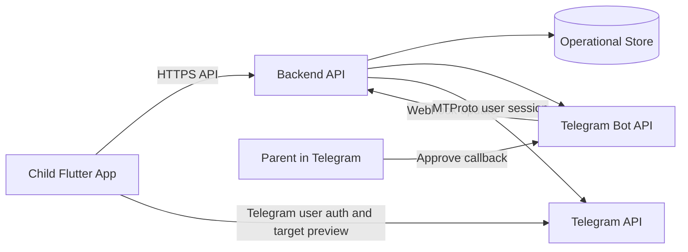
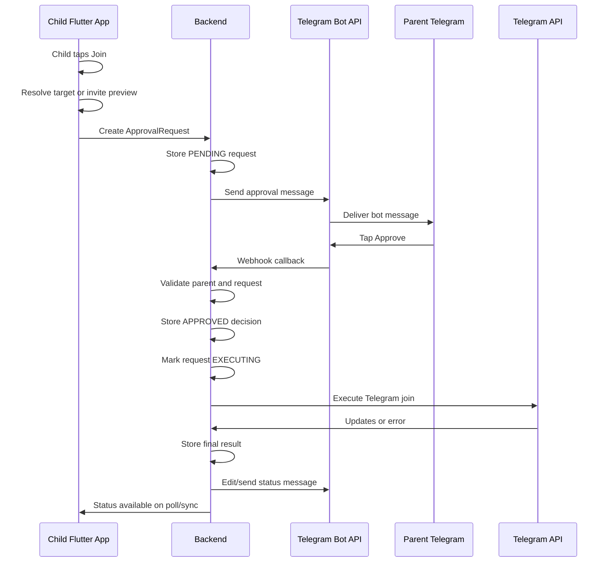
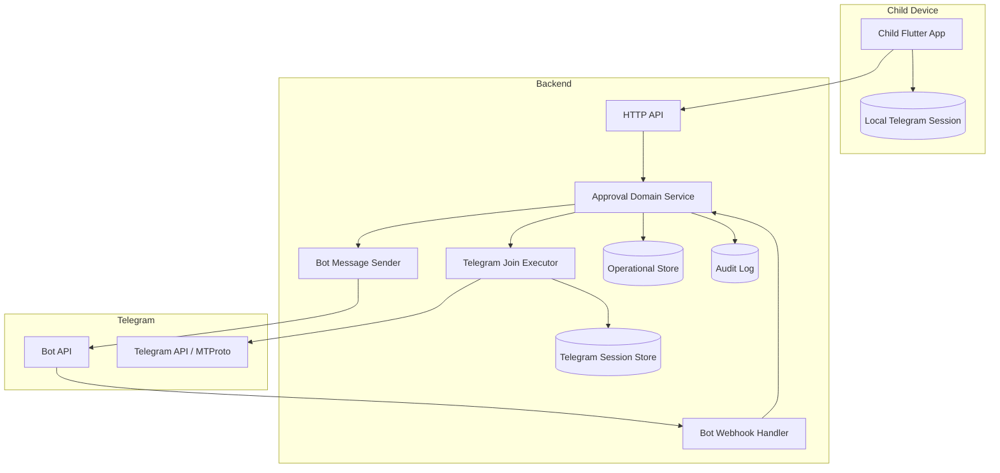
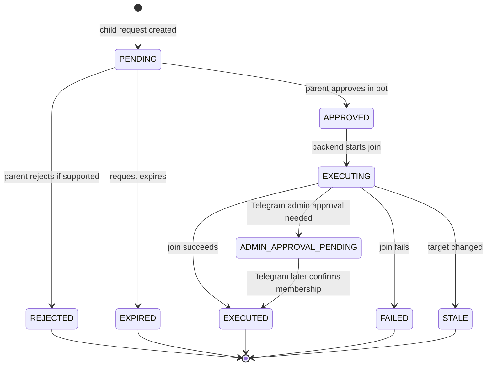

# MVP Bot Architecture

## Purpose

This document defines the smallest MVP architecture for Telegram Kids using:

- Child Flutter App.
- Backend.
- Parent Telegram Bot.

The MVP excludes a Parent Android App.

The end-to-end flow is:

1. Child requests join.
2. `ApprovalRequest` is created.
3. Parent receives Telegram Bot message.
4. Parent approves.
5. Backend executes join.

## System Context

## Runtime Components

### Child Flutter App

Responsibilities:

- Authenticate the child Telegram account.
- Render the minimum Telegram surface needed to discover or open join targets.
- Detect restricted join attempts.
- Resolve public targets or check private invite metadata when possible.
- Create approval requests through the backend.
- Display pending, approved, failed, or joined status.

Non-responsibilities:

- Parent approval.
- Backend audit authority.
- Executing restricted joins for MVP.
- Preventing joins through official Telegram or other clients.

### Backend

Responsibilities:

- Store family, parent, child, Telegram account, bot link, approval request, decision, execution, and audit state.
- Own the approval request state machine.
- Send Telegram Bot approval messages.
- Verify Telegram Bot webhook and callback authenticity.
- Authorize parent bot actions against linked family membership.
- Execute approved Telegram joins.
- Record final execution state.

Non-responsibilities:

- Parent Android App workflows.
- Global enforcement outside Telegram Kids.
- Content moderation.

### Parent Telegram Bot

Responsibilities:

- Notify parents about pending join requests.
- Present compact target context.
- Submit approve callbacks to the backend.

Non-responsibilities:

- Acting as the child Telegram user.
- Storing approval state.
- Managing family records directly.

## Approval Sequence

## Component Architecture

## State Machine

## Backend Execution Model

Backend-executed joins require backend custody of a Telegram user session for the child account.

Minimum requirements:

- Store Telegram session material only in a dedicated encrypted session store.
- Keep session access limited to the join executor.
- Never expose Telegram session material to the bot, parent, logs, or general API handlers.
- Execute only approved, non-expired requests.
- Re-check target metadata before joining where possible.
- Map Telegram outcomes to durable request states.

## Bot Approval Security

The Telegram Bot approval callback must be treated as an authenticated action only after backend validation.

Required checks:

- Webhook request is from Telegram or uses a configured secret token.
- Callback payload references an existing approval request.
- Request is still `PENDING`.
- Telegram bot user is linked to an active parent record.
- Parent belongs to the same family as the child.
- Callback action has not already been applied.
- Request has not expired.

## Data Ownership

| Data | Owner | Storage |
| --- | --- | --- |
| Child profile | Backend | Operational store |
| Parent profile | Backend | Operational store |
| Parent Telegram bot link | Backend | Operational store |
| Child Telegram account metadata | Backend | Operational store |
| Child Telegram session material | Backend join executor boundary | Encrypted session store |
| Approval request | Backend | Operational store |
| Approval decision | Backend | Operational store |
| Join execution result | Backend | Operational store |
| Audit event | Backend | Audit log |
| Bot token | Backend | Secrets store |

## API Surface

Minimum MVP APIs:

- `POST /approval-requests`: child creates a pending join request.
- `GET /approval-requests/{id}`: child checks request status.
- `POST /telegram-bot/webhook`: Telegram Bot update webhook.
- `POST /telegram-sessions/link`: child links Telegram session material for backend execution.

The final session-linking API shape requires a separate security review before implementation.

## Bypass Boundary

This MVP can prevent joins only inside the Telegram Kids controlled flow.

It cannot prevent:

- Official Telegram app joins.
- Telegram Web or Desktop joins.
- Third-party Telegram client joins.
- Joins from another already-authenticated device.
- Direct additions by another Telegram user.

Parent onboarding must state that device-level controls are required to reduce alternate-client bypass.

## Related Documents

- [Onboarding Specification](../specs/onboarding.md)
- [MVP Bot Approval Flow Specification](../specs/mvp-bot-approval-flow.md)
- [Telegram Validation Report](../specs/telegram-validation-report.md)
- [ADR-011: Telegram Bot as MVP Parent Approval Interface](../decisions/ADR-011-telegram-bot-as-mvp-parent-approval-interface.md)
- [ADR-012: Backend-Executed Telegram Joins for Bot MVP](../decisions/ADR-012-backend-executed-telegram-joins-for-bot-mvp.md)
