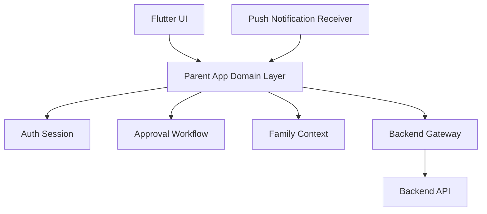
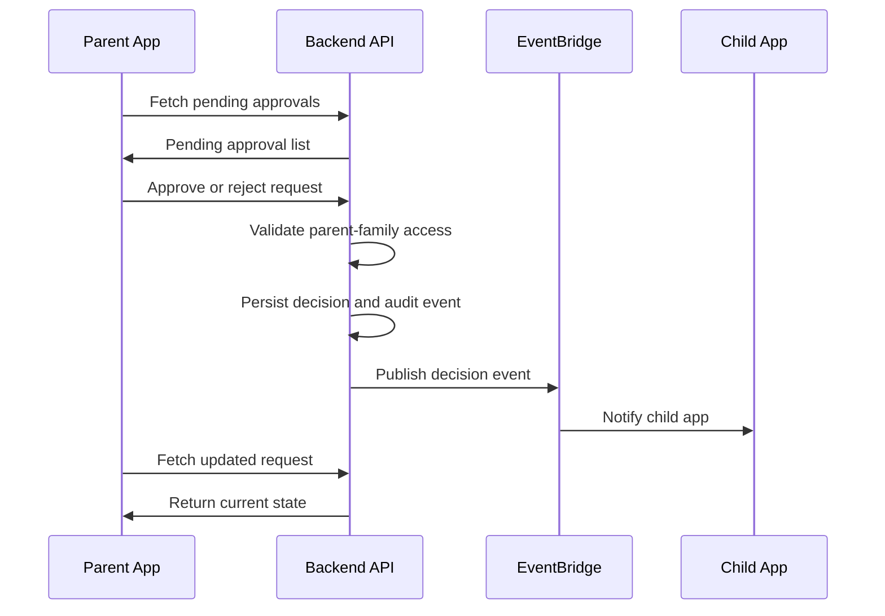

# Parent App Architecture

## Status

Deferred to V2.

## Purpose

The parent app is a future V2 interface for managing approval requests and family operations.

## Platform

- Flutter.
- Android target for MVP.
- Cognito-backed parent authentication through backend APIs.
- Push notifications for pending approvals.

## Component Diagram

## Responsibilities

- Parent sign-in.
- Display children in the family.
- Display pending approval requests.
- Show Telegram target metadata needed for a decision.
- Approve or reject requests.
- Display approval history.
- Register push notification token.
- Explain device-level bypass mitigation during onboarding.

## Approval UX Requirements

For each pending request, the parent app should show:

- Child display name.
- Request type: channel, group, supergroup, or unknown invite.
- Target title.
- Public username or invite indicator when available.
- Participant count when available.
- Request timestamp.
- Expiry state.
- Prior decision state if the request is no longer pending.

The parent app should avoid implying that approval always means immediate Telegram membership. The execution state may remain pending until the child app is online and Telegram accepts the join.

## Parent Decision Flow

## Authentication

The parent app authenticates through Cognito-supported backend flows. The backend maps Cognito subject claims to parent records and family permissions.

MVP parent app does not authenticate directly to Telegram for child account control.

## Security Notes

- Parent app decisions must be authorized by backend family membership checks.
- Approval and rejection APIs must be idempotent.
- Parent app must not receive Telegram child session material.
- Parent app must not directly execute Telegram joins.

## Future Extensions

- Multiple parents per family.
- Multiple children per family.
- Telegram Bot secondary approval interface.
- Web portal.
- Weekly reports and analytics.

## MVP Notes

- The parent app is not part of the bot-first MVP.
- Use the Telegram Bot for parent onboarding and approvals in MVP.
