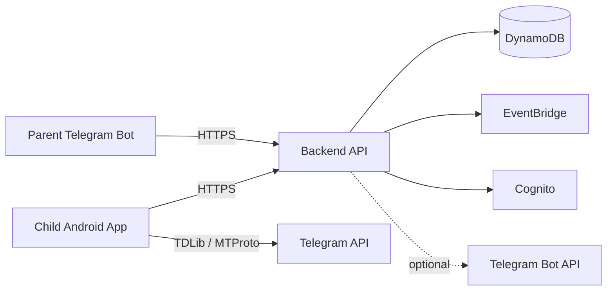

# System Overview

## MVP Architecture

## Principle

Backend is the single source of truth.

All approval decisions are enforced by backend services.

The child app executes Telegram joins only after backend approval because the child Telegram session is stored on the child device for MVP.

## Core Domains

### Family

- Parent
- Child
- Family

### Approval

- ApprovalRequest
- ApprovalDecision

### Telegram

- TelegramAccount
- GroupJoinRequest
- ChannelJoinRequest

## Future Scalability

Design for:

- Multiple children per family
- Multiple parents per family
- Multiple approval interfaces

## Detailed Architecture

- [MVP Architecture](mvp-architecture.md)
- [Child App Architecture](child-app-architecture.md)
- [Parent App Architecture](parent-app-architecture.md)
- [Backend Architecture](backend-architecture.md)
- [Telegram Integration Architecture](telegram-integration-architecture.md)
- [AWS Infrastructure Architecture](aws-infrastructure-architecture.md)
