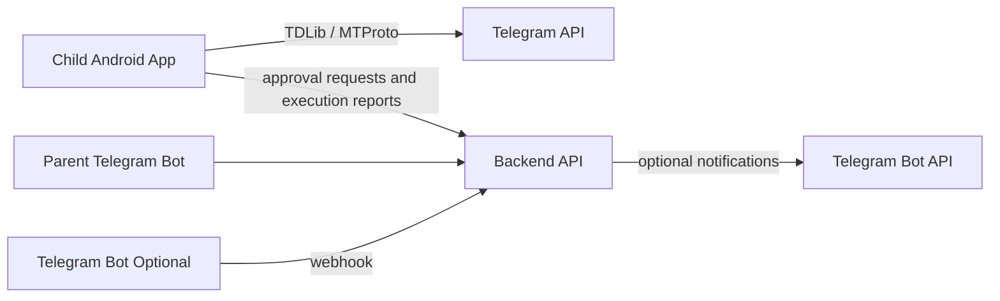
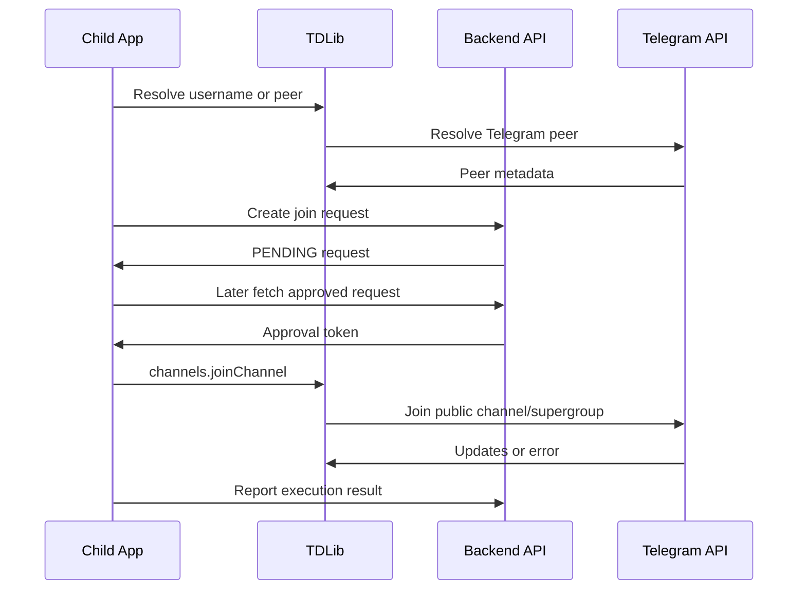
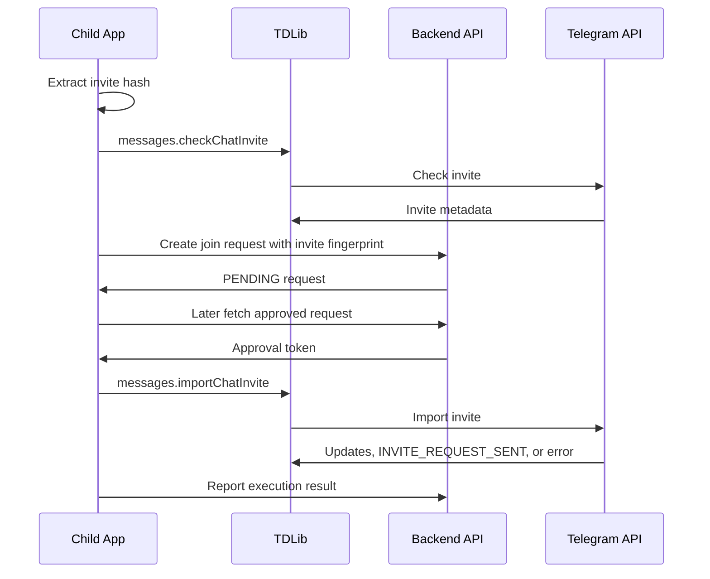

# Telegram Integration Architecture

## Purpose

This document defines how Telegram Kids integrates with Telegram for MVP.

## Integration Surfaces

## Child User Client

The child app uses TDLib to operate as a Telegram user client.

Capabilities:

- User authentication.
- Chat list.
- Message receive and send.
- Channel reading.
- Public channel and supergroup resolution.
- Private invite preview.
- Approved join execution.

Sensitive Telegram session material remains local to the child device.

## Parent Bot

The Telegram Bot API may be used later for parent notifications or approval shortcuts.

Allowed uses:

- Send pending approval notifications to linked parent Telegram accounts.
- Receive parent approve/reject commands after secure account linking.
- Provide status summaries.

Disallowed uses:

- Joining groups or channels on behalf of the child.
- Reading the child's Telegram messages.
- Acting as the child user.

## Public Channel and Supergroup Join

## Private Invite Join

## Metadata Normalization

The child app sends backend-safe target metadata:

- Target type.
- Telegram peer ID when available.
- Public username when available.
- Invite hash fingerprint, not necessarily raw invite hash.
- Title.
- Participant count when available.
- Request-needed flag.
- Subscription or payment-required indicator when available.
- Observed timestamp.

The backend stores enough metadata for parent decision and audit. It must not require raw Telegram session data.

## Error Mapping

| Telegram outcome | Backend state |
| --- | --- |
| Join succeeded | `EXECUTED` |
| User already participant | `EXECUTED` or policy conflict |
| Invite request sent | `ADMIN_APPROVAL_PENDING` |
| Invite expired | `EXPIRED` |
| Invite invalid | `FAILED` |
| Channel private | `FAILED` or `STALE` |
| Too many channels | `FAILED` |
| Payment required | `FAILED` |
| Account frozen | `FAILED` |
| Target metadata changed | `STALE` |

## Bypass Boundary

Telegram Kids cannot prevent joins performed through:

- Official Telegram Android app.
- Telegram Web.
- Telegram Desktop.
- Third-party Telegram clients.
- Another device already logged into the same Telegram account.

Parents must use device-level controls, such as Android Family Link, to block official Telegram and unknown Telegram clients on supervised child devices.

## Related ADRs

- [ADR-001: Use TDLib for Child Telegram Client Integration](../decisions/ADR-001-use-tdlib-for-child-telegram-client.md)
- [ADR-002: Client-Executed Approved Telegram Joins](../decisions/ADR-002-client-executed-approved-telegram-joins.md)
- [ADR-007: Keep Child Telegram Session Material On Device](../decisions/ADR-007-keep-child-telegram-session-material-on-device.md)
