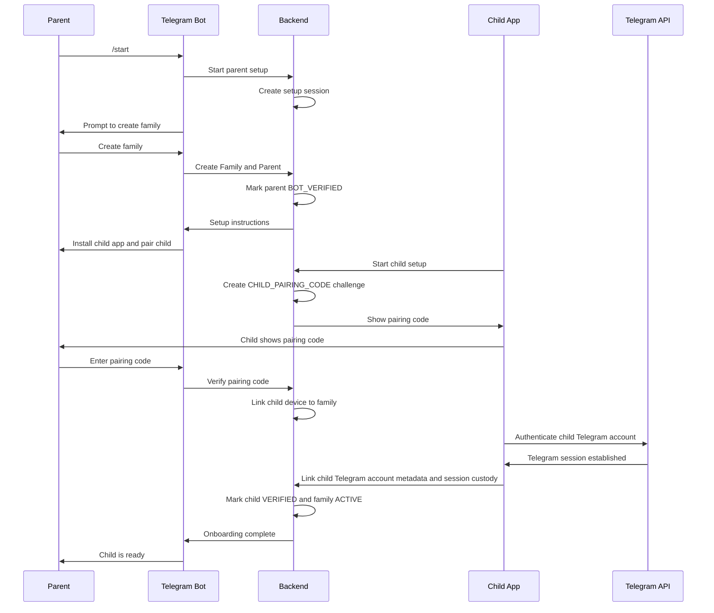
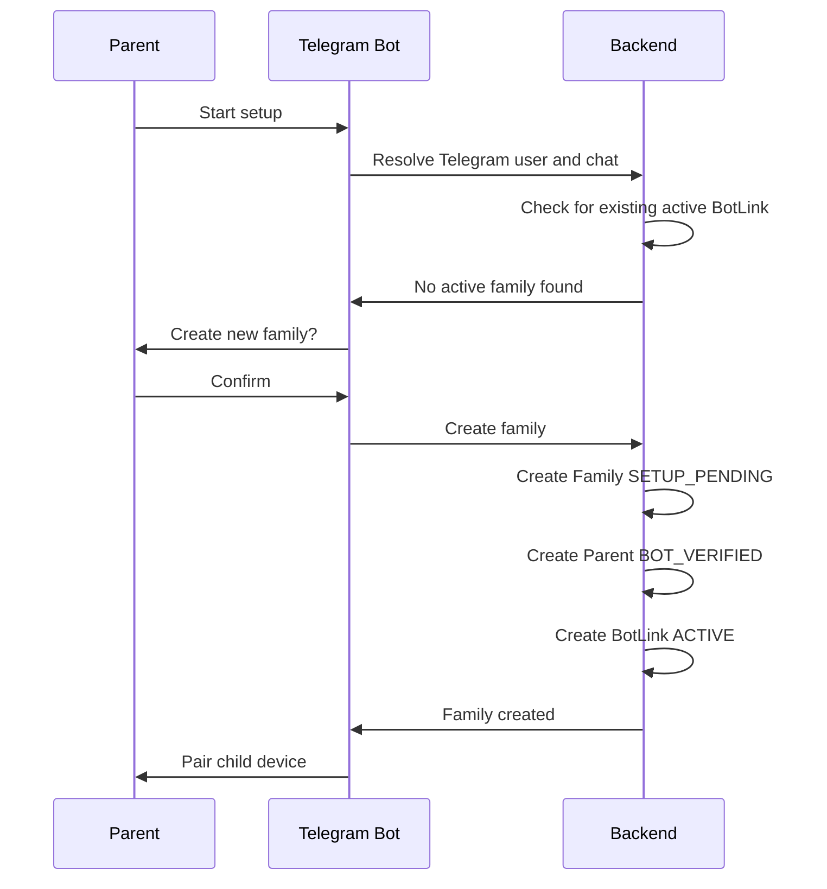
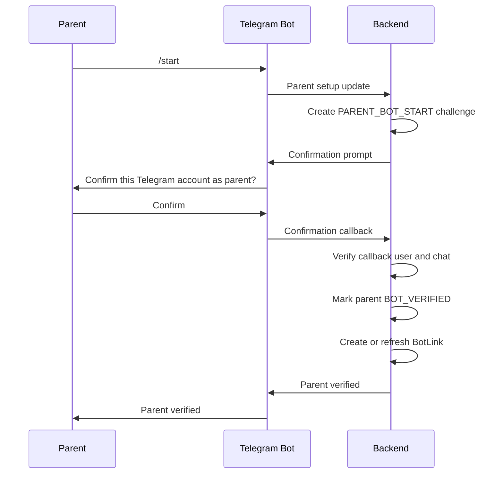
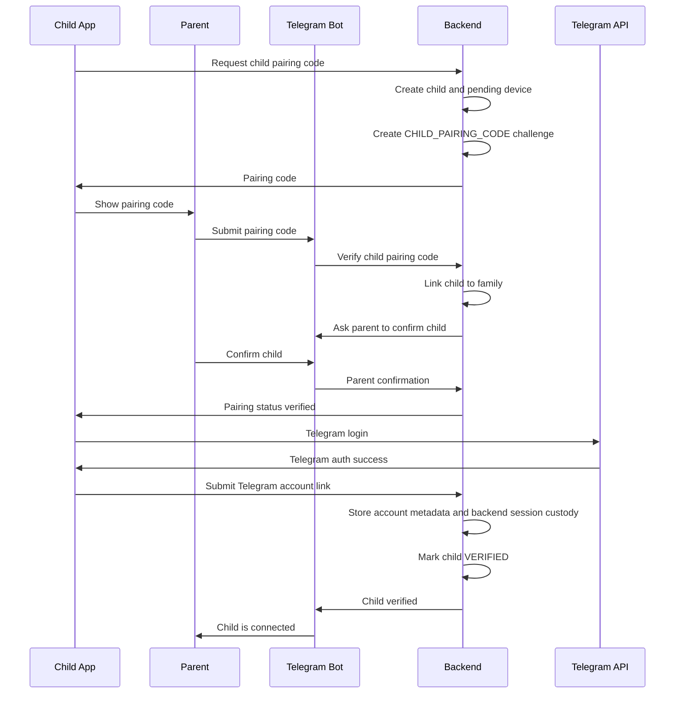
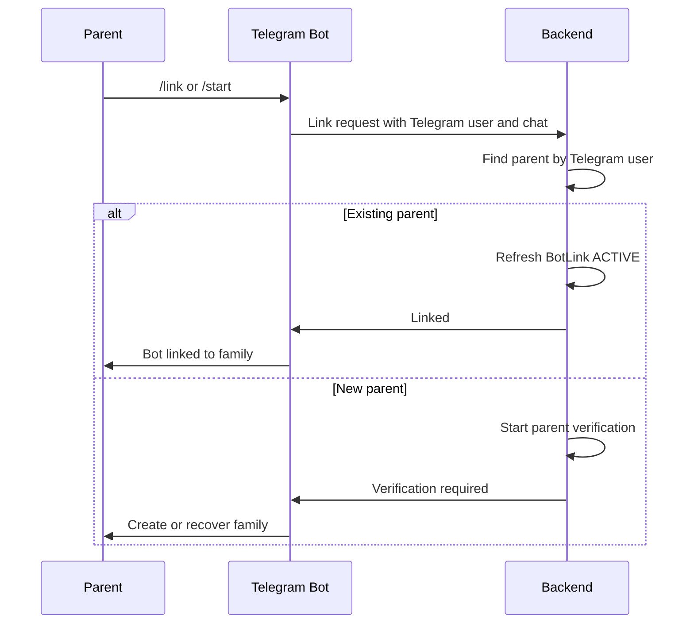
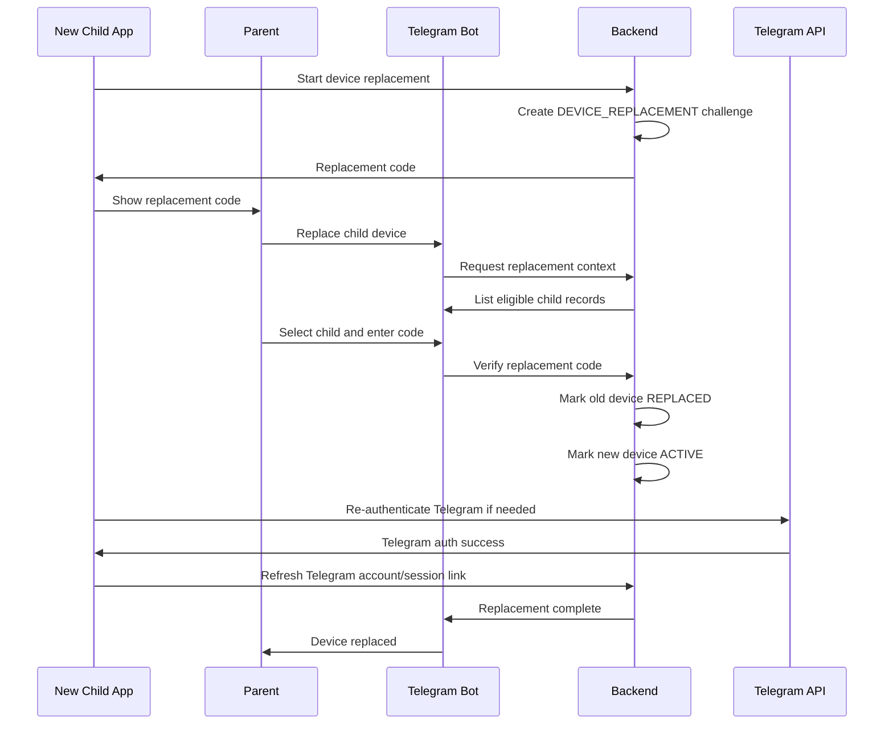
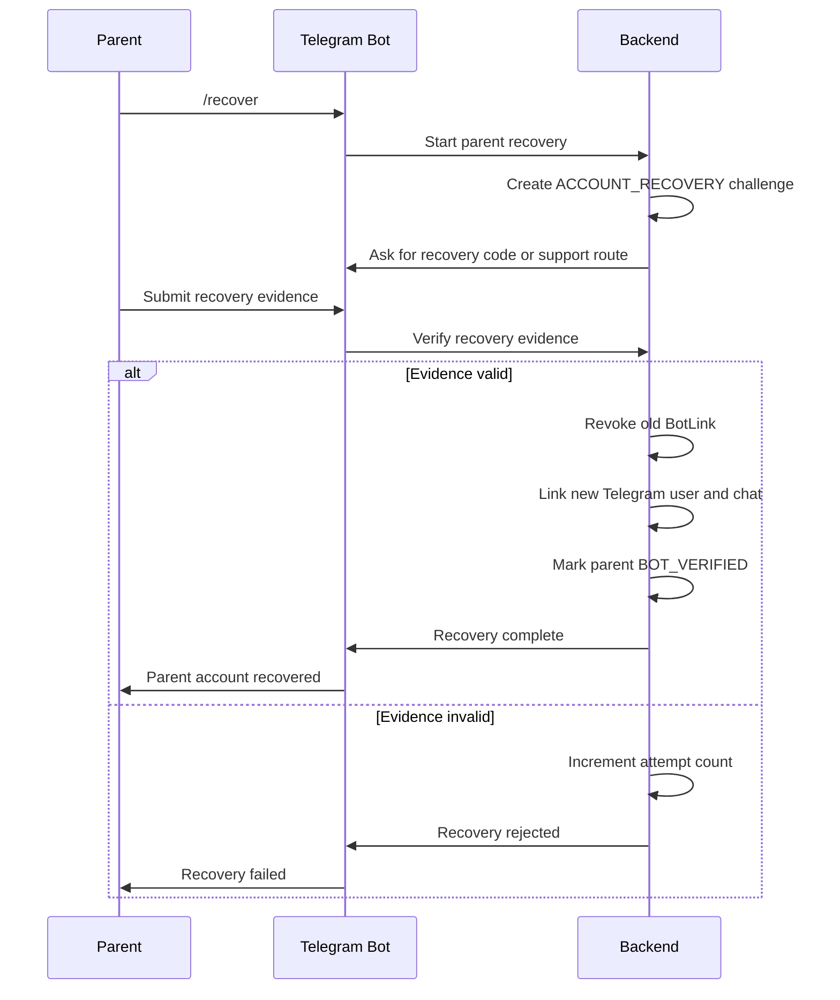
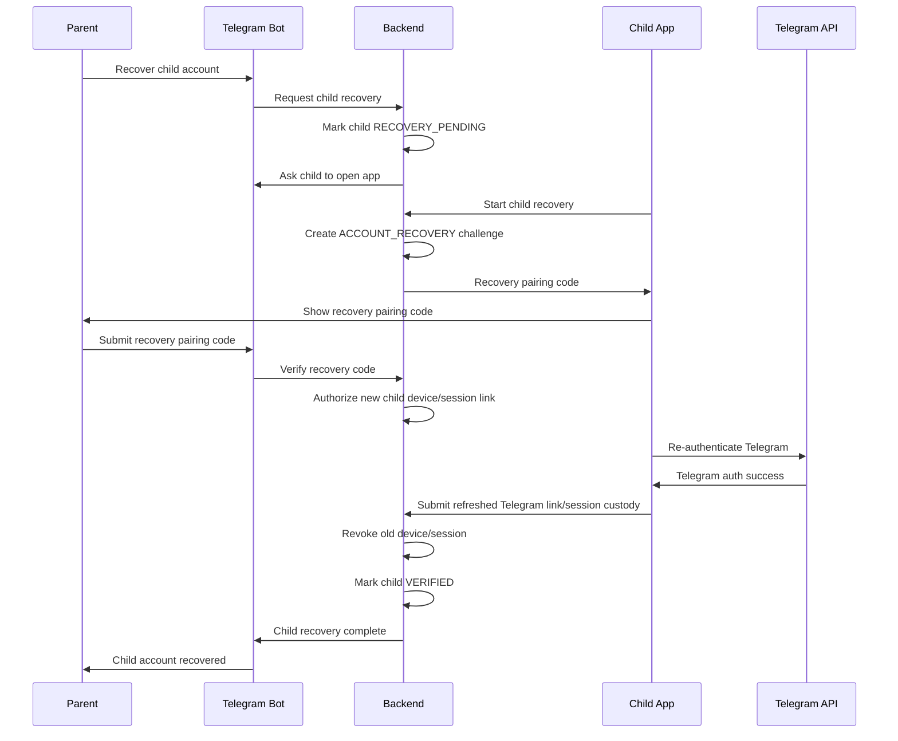

# Onboarding Specification

## Status

Proposed for bot-first MVP.

## Purpose

This specification defines complete onboarding for the bot-first MVP using:

- Child.
- Parent.
- Telegram Bot.

The backend is the source of truth for family, parent, child, bot link, device, session, verification, and audit state.

## Scope

In scope:

- First installation.
- Family creation.
- Parent verification.
- Child verification.
- Telegram Bot linking.
- Device replacement.
- Parent account recovery.
- Child account recovery.
- User flows.
- Sequence diagrams.
- Acceptance criteria.
- Failure scenarios.

Out of scope:

- Parent Android App.
- Full parent profile management UI.
- Multi-parent invitation beyond a single verified parent for MVP.
- Payment, subscription, and advanced account settings.
- Production customer-support tooling.

## Actors

### Child

The child uses the Child Flutter App and authenticates their Telegram account. The child can request joins only after the device and Telegram account are linked to a verified family.

### Parent

The parent uses Telegram to interact with the Telegram Bot. The parent creates or recovers the family, links the child, and approves join requests.

### Telegram Bot

The Telegram Bot is the parent-facing onboarding and approval surface. It presents setup prompts, receives parent actions, sends verification prompts, and submits callbacks to the backend.

## Domain Objects

### Family

Required fields:

- `familyId`
- `status`
- `createdByParentId`
- `createdAt`

Statuses:

- `SETUP_PENDING`
- `ACTIVE`
- `RECOVERY_LOCKED`
- `DISABLED`

### Parent

Required fields:

- `parentId`
- `familyId`
- `telegramUserId`
- `telegramChatId`
- `verificationStatus`
- `recoveryStatus`
- `createdAt`

Verification statuses:

- `UNVERIFIED`
- `BOT_VERIFIED`
- `RECOVERY_PENDING`
- `LOCKED`

### Child

Required fields:

- `childId`
- `familyId`
- `displayName`
- `verificationStatus`
- `activeDeviceId`
- `telegramAccountId`
- `createdAt`

Verification statuses:

- `PENDING_PARENT_CONFIRMATION`
- `VERIFIED`
- `REPLACEMENT_PENDING`
- `RECOVERY_PENDING`
- `LOCKED`

### Device

Required fields:

- `deviceId`
- `childId`
- `deviceFingerprint`
- `status`
- `registeredAt`
- `replacedAt`

Statuses:

- `PENDING`
- `ACTIVE`
- `REPLACED`
- `REVOKED`

### VerificationChallenge

Required fields:

- `challengeId`
- `familyId`
- `subjectType`
- `subjectId`
- `challengeType`
- `codeHash`
- `expiresAt`
- `attemptCount`
- `status`

Challenge types:

- `PARENT_BOT_START`
- `CHILD_PAIRING_CODE`
- `DEVICE_REPLACEMENT`
- `ACCOUNT_RECOVERY`

Statuses:

- `PENDING`
- `VERIFIED`
- `EXPIRED`
- `FAILED`
- `CANCELLED`

### BotLink

Required fields:

- `botLinkId`
- `parentId`
- `telegramUserId`
- `telegramChatId`
- `status`
- `linkedAt`
- `lastSeenAt`

Statuses:

- `ACTIVE`
- `REVOKED`
- `RECOVERY_PENDING`

## Onboarding Principles

- The Telegram Bot is the only MVP parent interface.
- Parent Telegram identity is verified through Telegram Bot interaction and backend-issued one-time challenges.
- The child device is not trusted until the parent confirms the pairing in the Telegram Bot.
- A child Telegram account is not trusted until linked to a verified child and family.
- Every linking, replacement, recovery, and revocation event must be audited.
- Verification codes and callback payloads must be single-use, expiring, and rate-limited.
- Raw Telegram session material, login codes, 2FA passwords, bot tokens, and raw invite hashes must never be logged.

## Flow 1: First Installation

### User Flow

1. Parent opens the Telegram Bot and taps Start.
2. Telegram Bot creates or resumes a parent setup session.
3. Parent creates a family.
4. Telegram Bot marks the parent Telegram chat as linked after verification.
5. Child installs the Child Flutter App.
6. Child starts setup and receives a pairing code.
7. Parent enters or approves the pairing code in Telegram Bot.
8. Child authenticates the child Telegram account in the Child Flutter App.
9. Backend links the child device and Telegram account to the family.
10. Family becomes active when parent, child, device, and child Telegram account are verified.

### Sequence Diagram

### Acceptance Criteria

- Parent can start onboarding from Telegram Bot.
- Backend creates one setup session per active Telegram chat.
- Parent can create a family without a Parent Android App.
- Child app can generate a pairing code.
- Pairing code links the child only after parent confirmation in Telegram Bot.
- Child Telegram account is linked only after successful Telegram authentication.
- Family is not `ACTIVE` until parent, child, device, and Telegram account are verified.
- All setup events are audited.

### Failure Scenarios

- Parent starts bot twice: backend resumes the existing setup session.
- Parent abandons setup: setup session expires and can be restarted.
- Child pairing code expires: child app must generate a new code.
- Parent enters wrong code: attempt count increments and the challenge eventually fails.
- Child fails Telegram login: child remains unverified.
- Backend cannot store Telegram session material: child account link fails and family remains setup-pending.
- Telegram Bot message delivery fails: backend keeps setup state and retries within notification policy.

## Flow 2: Family Creation

### User Flow

1. Parent starts Telegram Bot.
2. Bot asks whether to create a new family.
3. Parent confirms.
4. Backend creates `Family`, `Parent`, and `BotLink`.
5. Bot displays the next setup step: child pairing.

### Sequence Diagram

### Acceptance Criteria

- A Telegram user can create only one active MVP family by default.
- Repeated create requests are idempotent for the same Telegram user and chat.
- Family creation creates an active bot link for the parent.
- Family creation emits an audit event.

### Failure Scenarios

- Telegram user already linked to an active family: bot resumes that family instead of creating a duplicate.
- Backend write partially fails: operation rolls back or leaves a resumable setup session.
- Bot callback is replayed: backend returns current family state without creating another family.

## Flow 3: Parent Verification

### User Flow

1. Parent starts Telegram Bot.
2. Backend receives Telegram user ID and chat ID from the bot update.
3. Backend creates a one-time parent verification challenge.
4. Parent confirms setup action in the same Telegram chat.
5. Backend binds `telegramUserId` and `telegramChatId` to the parent record.

For MVP, Telegram Bot possession is the parent verification factor. A stronger recovery factor can be added later.

### Sequence Diagram

### Acceptance Criteria

- Parent verification binds a single Telegram user ID to the parent record.
- Bot callback user ID must match the Telegram user who started verification.
- Verification challenge expires.
- Verification is idempotent for an already linked parent.
- Verification emits an audit event.

### Failure Scenarios

- Callback comes from another Telegram user: reject and audit.
- Callback arrives after expiry: reject and ask parent to restart.
- Telegram chat is blocked or deleted: parent cannot complete bot verification until bot is restarted.
- Parent's Telegram account is compromised: recovery lock can be applied manually or through future support tooling.

## Flow 4: Child Verification

### User Flow

1. Child opens Child Flutter App.
2. Child enters display name or selects setup mode.
3. Backend creates a pairing code.
4. Parent confirms the code through Telegram Bot.
5. Child authenticates their Telegram account in the Child Flutter App.
6. Backend links child profile, device, and Telegram account.

### Sequence Diagram

### Acceptance Criteria

- Child cannot join protected targets until child verification completes.
- Pairing code is short-lived and single-use.
- Parent must confirm the child in Telegram Bot.
- Child Telegram account ID is bound to the child record.
- Active device ID is bound to the child record.
- Reusing a pairing code after success fails.

### Failure Scenarios

- Child loses network during pairing: child app can poll or resume with the same unexpired challenge.
- Pairing code entered by wrong family: reject because code is scoped to setup session and expiry.
- Parent rejects or ignores child confirmation: child remains pending.
- Telegram authentication fails or requires 2FA: child app stays in Telegram login state.
- Child tries to link a Telegram account already linked to another active child: reject and require recovery or unlink flow.

## Flow 5: Telegram Bot Linking

### User Flow

1. Parent opens Telegram Bot.
2. Bot receives Telegram user ID and chat ID.
3. Backend creates or refreshes `BotLink`.
4. Bot confirms the family and child state.
5. Future approval messages are sent to the linked Telegram chat.

### Sequence Diagram

### Acceptance Criteria

- Bot link is active only after parent verification.
- Bot link stores Telegram user ID and chat ID.
- Approval messages are sent only to active bot links.
- Blocking the bot prevents delivery but does not delete backend family state.
- Re-linking from the same Telegram user refreshes `lastSeenAt`.

### Failure Scenarios

- Parent blocks bot: delivery fails and backend records notification failure.
- Parent changes Telegram account: must use parent account recovery.
- Telegram group chat tries to link: reject for MVP unless explicitly supported later.
- Same Telegram user tries to link multiple active families: backend resumes the active family and requires support flow for migration.

## Flow 6: Device Replacement

### User Flow

1. Child installs Child Flutter App on a new device.
2. Child starts replacement flow and receives a replacement code.
3. Parent opens Telegram Bot and selects replace child device.
4. Parent enters or confirms replacement code.
5. Backend marks old device `REPLACED`.
6. Backend marks new device `ACTIVE`.
7. Child re-authenticates Telegram account if required.
8. Backend updates session custody for backend-executed joins.

### Sequence Diagram

### Acceptance Criteria

- Device replacement requires parent confirmation in Telegram Bot.
- Old device cannot create new approval requests after replacement.
- New device cannot become active without a valid replacement challenge.
- Replacement is audited.
- Existing pending approval requests are either preserved or expired according to backend policy.

### Failure Scenarios

- Old device is still online: backend rejects requests from old device after replacement.
- Replacement code expires: new device must request a fresh code.
- Parent selects wrong child: parent can cancel before confirmation.
- Telegram re-authentication fails: new device is active for app setup but Telegram account remains recovery-pending.
- Session custody refresh fails: backend-executed joins remain disabled until resolved.

## Flow 7: Parent Account Recovery

### User Flow

1. Parent loses access to the linked Telegram account or bot chat.
2. Parent starts recovery from Telegram Bot using a new Telegram account.
3. Backend creates an account recovery challenge.
4. Parent proves access using configured recovery evidence.
5. Backend revokes old `BotLink`.
6. Backend links the new Telegram user and chat.
7. Backend unlocks family approval actions.

For MVP, configured recovery evidence should be one of:

- A recovery code generated during initial onboarding.
- Manual administrator verification.

### Sequence Diagram

### Acceptance Criteria

- Parent account recovery cannot be completed with Telegram user possession alone.
- Recovery challenge is expiring and rate-limited.
- Successful recovery revokes old bot link.
- Approval callbacks from old bot link fail after recovery.
- Recovery emits audit events.

### Failure Scenarios

- Recovery code is lost: parent must use manual administrator verification.
- Recovery code is entered incorrectly too many times: recovery is locked.
- Old Telegram account is compromised: backend can set family `RECOVERY_LOCKED` and disable approvals until recovery completes.
- Attacker starts recovery from a new Telegram account: recovery fails without valid evidence.

## Flow 8: Child Account Recovery

### User Flow

1. Child loses access to the device or Telegram session.
2. Parent starts child recovery in Telegram Bot.
3. Backend places child in `RECOVERY_PENDING`.
4. Child installs or opens Child Flutter App.
5. Child receives a recovery pairing code.
6. Parent confirms recovery code in Telegram Bot.
7. Child re-authenticates Telegram.
8. Backend replaces device/session records and marks child `VERIFIED`.

### Sequence Diagram

### Acceptance Criteria

- Child recovery requires parent action in Telegram Bot.
- Old device/session records are revoked or replaced.
- Child cannot create new join requests while `RECOVERY_PENDING`.
- Telegram account re-authentication is required if session custody cannot be restored.
- Recovery emits audit events.

### Failure Scenarios

- Child cannot complete Telegram login: child remains recovery-pending.
- Recovery code expires: child must request a new code.
- Parent selects wrong child: recovery can be cancelled before confirmation.
- Old device submits requests during recovery: backend rejects or marks them stale.
- Telegram account is permanently lost: parent must create a new child Telegram account link or disable the child record.

## Cross-flow Security Requirements

- Verification and recovery codes must be short-lived.
- Codes must be stored hashed, not in plaintext.
- Codes must be scoped to family, subject, challenge type, and expiry.
- Telegram Bot callbacks must be verified against Telegram user ID and chat ID.
- All state-changing callbacks must be idempotent.
- Sensitive values must be redacted from logs and audit events.
- Recovery attempts must be rate-limited.
- Device replacement and account recovery must revoke stale links.
- Backend must expose only current authoritative status to child app and bot.

## Cross-flow Acceptance Criteria

- A family cannot become active without a verified parent, linked bot, verified child, active child device, and linked child Telegram account.
- No approval request can be created by an unverified child.
- No approval message can be sent to an unverified bot link.
- No bot approval can be accepted from an unlinked Telegram user.
- Device replacement invalidates the previous active child device.
- Parent account recovery invalidates the previous active bot link.
- Child account recovery invalidates stale child device/session records.
- All onboarding, linking, replacement, recovery, and failure events are auditable.

## Related Documents

- [MVP Bot Approval Flow Specification](mvp-bot-approval-flow.md)
- [MVP Bot Architecture](../architecture/mvp-bot-architecture.md)
- [ADR-011: Telegram Bot as MVP Parent Approval Interface](../decisions/ADR-011-telegram-bot-as-mvp-parent-approval-interface.md)
- [ADR-012: Backend-Executed Telegram Joins for Bot MVP](../decisions/ADR-012-backend-executed-telegram-joins-for-bot-mvp.md)
